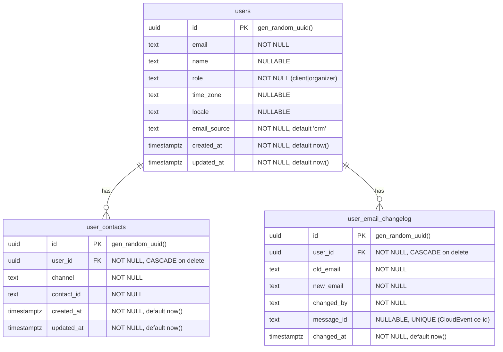

# event-users: Data Model

## ER Diagram



## Table: `users`

Source: `db/models.py:11-39`, migration `alembic/versions/0001_initial.py:24-52`

| Column | Type | Nullable | Default | Notes |
|--------|------|----------|---------|-------|
| `id` | `UUID` | NO | `gen_random_uuid()` | Primary key |
| `email` | `TEXT` | NO | -- | User's email address |
| `name` | `TEXT` | YES | NULL | Added in migration 0002 |
| `role` | `TEXT` | NO | -- | `"client"` or `"organizer"` (renamed from `"volunteer"` in migration 0003) |
| `time_zone` | `TEXT` | YES | NULL | IANA timezone string (e.g., `"Europe/Moscow"`) |
| `locale` | `TEXT` | YES | NULL | Preferred language tag (e.g., `"ru"`, `"en"`). Added in migration 0007; no producer sets it yet — read path only (`GET`/`POST /api/users/by-ids`) |
| `email_source` | `TEXT` | NO | `'crm'` | Источник последнего изменения email: `'crm'` или `'admin'`. Added in migration 0004 |
| `created_at` | `TIMESTAMPTZ` | NO | `now()` | Row creation time |
| `updated_at` | `TIMESTAMPTZ` | NO | `now()` | Last modification time |

**Constraints**:
- `uq_users_email_role` -- UNIQUE(`email`, `role`)
- `ix_users_email` -- B-tree index on `email`
- `ix_users_role` -- B-tree index on `role`

**`email_source` semantics**: информационный столбец. `'admin'` выставляется при изменении email администратором (REST или RabbitMQ путь). `'crm'` выставляется при синхронизации через event-db-sync (`upsert_user_from_crm`). Столбец не используется для guard-логики.

## Table: `user_contacts`

Source: `db/models.py:42-72`, migration `alembic/versions/0001_initial.py:54-82`

| Column | Type | Nullable | Default | Notes |
|--------|------|----------|---------|-------|
| `id` | `UUID` | NO | `gen_random_uuid()` | Primary key |
| `user_id` | `UUID` | NO | -- | FK to `users.id`, CASCADE on delete |
| `channel` | `TEXT` | NO | -- | Contact channel type (`email`, `telegram`, `push`, etc.) |
| `contact_id` | `TEXT` | NO | -- | Channel-specific identifier (email address, Telegram chat ID, push token, etc.) |
| `created_at` | `TIMESTAMPTZ` | NO | `now()` | Row creation time |
| `updated_at` | `TIMESTAMPTZ` | NO | `now()` | Last modification time |

**Constraints**:
- `uq_user_contacts_user_id_channel` -- UNIQUE(`user_id`, `channel`) -- one contact_id per channel per user
- `ix_user_contacts_user_id` -- B-tree index on `user_id`
- FK `user_id -> users.id` with `ON DELETE CASCADE`

**Note**: No index on `channel` alone. Channel-based lookups across all users require a full table scan (see audit LOW finding).

## Table: `user_email_changelog`

Журнал изменений email пользователей. Запись создаётся при каждой успешной смене email по запросу администратора.

| Column | Type | Nullable | Default | Notes |
|--------|------|----------|---------|-------|
| `id` | `UUID` | NO | `gen_random_uuid()` | Primary key |
| `user_id` | `UUID` | NO | -- | FK to `users.id`, CASCADE on delete |
| `old_email` | `TEXT` | NO | -- | Email до изменения |
| `new_email` | `TEXT` | NO | -- | Email после изменения |
| `changed_by` | `TEXT` | NO | -- | Идентификатор администратора (`requested_by` из CloudEvent payload или `sub` JWT для REST-пути) |
| `message_id` | `TEXT` | YES | NULL | CloudEvent `ce-id` сообщения — ключ идемпотентности консьюмера. NULL для REST-пути. Added in migration 0005 |
| `changed_at` | `TIMESTAMPTZ` | NO | `now()` | Время изменения |

**Constraints**:
- FK `user_id -> users.id` с `ON DELETE CASCADE`
- `ix_user_email_changelog_user_id` -- B-tree index на `user_id`
- `ix_user_email_changelog_changed_at` -- B-tree index на `changed_at`
- `uq_user_email_changelog_message_id` -- UNIQUE index на `message_id` (повторная доставка сообщения вызывает конфликт и обработка пропускается; NULL не конфликтуют)

## User Sync Upsert Logic (event-db-sync)

Triggered by cal.com DB trigger via event-db-sync (`user.upserted` → `handle_user_upserted`). Source: `adapters/users_db.py` (`upsert_user_from_crm`, `_upsert_contacts`)

```sql
INSERT INTO users (email, name, role, time_zone, email_source)
VALUES (:email, :name, :role, :time_zone, 'crm')
ON CONFLICT (email, role)
DO UPDATE SET
    name = COALESCE(EXCLUDED.name, users.name),
    time_zone = COALESCE(EXCLUDED.time_zone, users.time_zone),
    email_source = 'crm',   -- convergence: CRM now exports exactly this email
    updated_at = now()
RETURNING id
```

Contacts (including the auto-maintained `email` contact) are upserted in a single batched statement:

```sql
INSERT INTO user_contacts (user_id, channel, contact_id)
SELECT :user_id, t.channel, t.contact_id
FROM unnest(CAST(:channels AS text[]), CAST(:contact_ids AS text[])) AS t(channel, contact_id)
ON CONFLICT (user_id, channel)
DO UPDATE SET contact_id = EXCLUDED.contact_id, updated_at = now()
```

**Semantics**:
- `COALESCE` is intentional: NULL from the source means "not provided", not "clear this field".
- Sets `email_source='crm'` on upsert.

## Migration Chain

| Revision | Date | Description | Source |
|----------|------|-------------|--------|
| `0001` | 2026-04-07 | Initial schema: `users` and `user_contacts` tables with constraints and indexes | `alembic/versions/0001_initial.py` |
| `0002` | 2026-04-07 | Add `name` column (nullable TEXT) to `users` | `alembic/versions/0002_add_user_name.py` |
| `0003` | 2026-04-13 | Rename role value `volunteer` to `organizer` (data migration) | `alembic/versions/0003_rename_volunteer_to_organizer.py` |
| `0004` | 2026-04-26 | Add `email_source` column to `users`; create `user_email_changelog` table (and `webhook_outbox`, subsequently removed) | `alembic/versions/0004_email_source_changelog_webhook_outbox.py` |
| `0005` | 2026-06-11 | Add unique `message_id` to `user_email_changelog` (consumer idempotency on CloudEvent ce-id) | `alembic/versions/0005_changelog_message_id.py` |
| `0006` | 2026-06-19 | Drop the unused `webhook_outbox` table (CRM webhook machinery removed) | `alembic/versions/0006_drop_webhook_outbox.py` |
| `0007` | 2026-07-13 | Add `locale` column (nullable TEXT) to `users` — exposed via `POST /api/users/by-ids` so event-scheduling can resolve a participant's preferred language | `alembic/versions/0007_add_user_locale.py` |

Current head: `0007`

Migration commands:
```bash
alembic upgrade head     # apply all
alembic downgrade -1     # revert last
```
