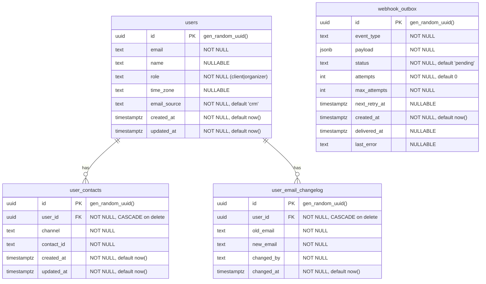

# event-users: Data Model

## ER Diagram



## Table: `users`

Source: `db/models.py:11-39`, migration `alembic/versions/0001_initial.py:24-52`

| Column | Type | Nullable | Default | Notes |
|--------|------|----------|---------|-------|
| `id` | `UUID` | NO | `gen_random_uuid()` | Primary key |
| `email` | `TEXT` | NO | -- | User's email address |
| `name` | `TEXT` | YES | NULL | Added in migration 0002 |
| `role` | `TEXT` | NO | -- | `"client"` or `"organizer"` (renamed from `"volunteer"` in migration 0003) |
| `time_zone` | `TEXT` | YES | NULL | IANA timezone string (e.g., `"Europe/Moscow"`) |
| `email_source` | `TEXT` | NO | `'crm'` | Источник последнего изменения email: `'crm'` или `'admin'`. Added in migration 0004 |
| `created_at` | `TIMESTAMPTZ` | NO | `now()` | Row creation time |
| `updated_at` | `TIMESTAMPTZ` | NO | `now()` | Last modification time |

**Constraints**:
- `uq_users_email_role` -- UNIQUE(`email`, `role`)
- `ix_users_email` -- B-tree index on `email`
- `ix_users_role` -- B-tree index on `role`

**`email_source` semantics**: CRM sync пропускает обновление email, если `email_source = 'admin'`. Это защищает email, выставленный администратором, от перезаписи CRM. После доставки изменения в CRM через `webhook_outbox` значение сбрасывается обратно в `'crm'`.

## Table: `user_contacts`

Source: `db/models.py:42-72`, migration `alembic/versions/0001_initial.py:54-82`

| Column | Type | Nullable | Default | Notes |
|--------|------|----------|---------|-------|
| `id` | `UUID` | NO | `gen_random_uuid()` | Primary key |
| `user_id` | `UUID` | NO | -- | FK to `users.id`, CASCADE on delete |
| `channel` | `TEXT` | NO | -- | Contact channel type (`email`, `telegram`, `push`, etc.) |
| `contact_id` | `TEXT` | NO | -- | Channel-specific identifier (email address, Telegram chat ID, push token, etc.) |
| `created_at` | `TIMESTAMPTZ` | NO | `now()` | Row creation time |
| `updated_at` | `TIMESTAMPTZ` | NO | `now()` | Last modification time |

**Constraints**:
- `uq_user_contacts_user_id_channel` -- UNIQUE(`user_id`, `channel`) -- one contact_id per channel per user
- `ix_user_contacts_user_id` -- B-tree index on `user_id`
- FK `user_id -> users.id` with `ON DELETE CASCADE`

**Note**: No index on `channel` alone. Channel-based lookups across all users require a full table scan (see audit LOW finding).

## Table: `user_email_changelog`

Журнал изменений email пользователей. Запись создаётся при каждой успешной смене email по запросу администратора.

| Column | Type | Nullable | Default | Notes |
|--------|------|----------|---------|-------|
| `id` | `UUID` | NO | `gen_random_uuid()` | Primary key |
| `user_id` | `UUID` | NO | -- | FK to `users.id`, CASCADE on delete |
| `old_email` | `TEXT` | NO | -- | Email до изменения |
| `new_email` | `TEXT` | NO | -- | Email после изменения |
| `changed_by` | `TEXT` | NO | -- | Идентификатор администратора, инициировавшего изменение (`requested_by` из CloudEvent payload) |
| `changed_at` | `TIMESTAMPTZ` | NO | `now()` | Время изменения |

**Constraints**:
- FK `user_id -> users.id` с `ON DELETE CASCADE`
- `ix_user_email_changelog_user_id` -- B-tree index на `user_id`

## Table: `webhook_outbox`

Transactional outbox для доставки изменений во внешние системы (в первую очередь CRM). Обеспечивает at-least-once доставку с retry-логикой.

| Column | Type | Nullable | Default | Notes |
|--------|------|----------|---------|-------|
| `id` | `UUID` | NO | `gen_random_uuid()` | Primary key |
| `event_type` | `TEXT` | NO | -- | Тип события (например, `user.email.changed`) |
| `payload` | `JSONB` | NO | -- | Данные для доставки |
| `status` | `TEXT` | NO | `'pending'` | Статус: `pending`, `delivered`, `failed` |
| `attempts` | `INT` | NO | `0` | Число попыток доставки |
| `max_attempts` | `INT` | NO | -- | Максимальное число попыток |
| `next_retry_at` | `TIMESTAMPTZ` | YES | NULL | Время следующей попытки (NULL = немедленно) |
| `created_at` | `TIMESTAMPTZ` | NO | `now()` | Время создания записи |
| `delivered_at` | `TIMESTAMPTZ` | YES | NULL | Время успешной доставки |
| `last_error` | `TEXT` | YES | NULL | Текст последней ошибки |

**Delivery semantics**:
- Запись создаётся в одной транзакции с обновлением `users.email` — гарантирует атомарность.
- После успешной доставки: `status='delivered'`, `delivered_at=now()`, `users.email_source='crm'`.
- При исчерпании `max_attempts`: `status='failed'`.

## CRM Sync Upsert Logic

Source: `adapters/users_db.py:228-258`

The CRM sync performs per-user upserts:

```sql
INSERT INTO users (email, name, role, time_zone)
VALUES (:email, :name, :role, :time_zone)
ON CONFLICT (email, role)
DO UPDATE SET
    name = COALESCE(EXCLUDED.name, users.name),
    time_zone = COALESCE(EXCLUDED.time_zone, users.time_zone),
    updated_at = now()
```

After the user upsert, a SELECT retrieves the user's `id`, then contacts are upserted:

```sql
INSERT INTO user_contacts (user_id, channel, contact_id)
VALUES (:user_id, :channel, :contact_id)
ON CONFLICT (user_id, channel)
DO UPDATE SET contact_id = EXCLUDED.contact_id, updated_at = now()
```

An `email` contact is always auto-created/updated alongside any explicit contacts.

**Semantics**:
- `COALESCE` means CRM-sent NULL values do NOT clear existing name/time_zone fields.
- Each user is committed independently (no transaction wrapping the full sync batch).
- Contacts are upserted row-by-row within the same implicit transaction as the parent user.

## Migration Chain

| Revision | Date | Description | Source |
|----------|------|-------------|--------|
| `0001` | 2026-04-07 | Initial schema: `users` and `user_contacts` tables with constraints and indexes | `alembic/versions/0001_initial.py` |
| `0002` | 2026-04-07 | Add `name` column (nullable TEXT) to `users` | `alembic/versions/0002_add_user_name.py` |
| `0003` | 2026-04-13 | Rename role value `volunteer` to `organizer` (data migration) | `alembic/versions/0003_rename_volunteer_to_organizer.py` |
| `0004` | 2026-04-26 | Add `email_source` column to `users`; create `user_email_changelog` and `webhook_outbox` tables | `alembic/versions/0004_email_change_feature.py` |

Current head: `0004`

Migration commands:
```bash
alembic upgrade head     # apply all
alembic downgrade -1     # revert last
```
